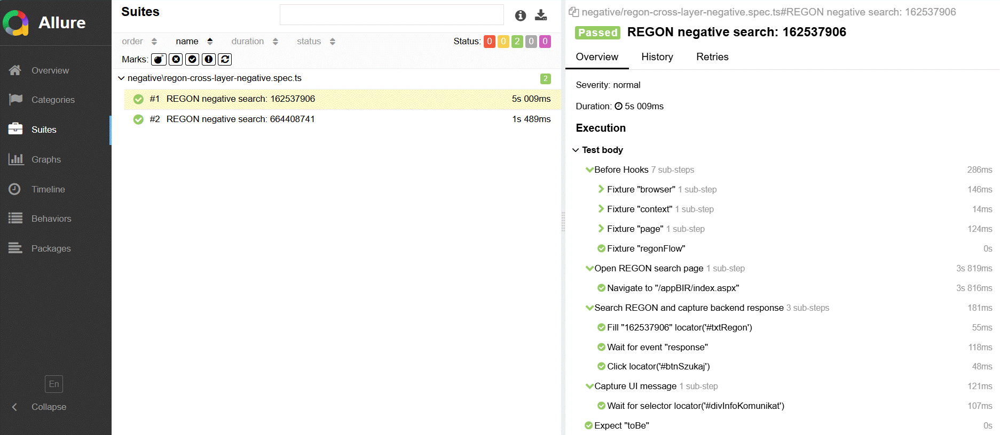

Cross-layer Playwright testing combining **UI validation with API verification** to detect defects earlier and increase test reliability.

---

## Abstract (po polsku)

Projekt demonstracyjny automatyzacji testów wykorzystujący **Playwright + TypeScript** do testowania wyszukiwania numeru **REGON**.  
Testy realizują podejście **cross-layer testing**, w którym działania użytkownika w interfejsie są weryfikowane poprzez dane zwracane przez API.  
Pozwala to wykrywać błędy szybciej i zwiększać wiarygodność testów.  
Projekt zawiera również raportowanie **Allure** z artefaktami testowymi (screenshots, trace).

---

## Project structure

```text
regon-playwright/
│
├─ .github/
│   └─ workflows/
│       └─ cross-layer-e2e.yml        # CI pipeline (optional)
│
├─ fixtures/
│   └─ test-fixtures.ts          # shared Playwright fixtures
│
├─ pages/
│   └─ regon-page.ts             # Page Object for REGON search
│
├─ tests/
│   └─ negativie/
│       └─ regon-cross-layer-negative.spec.ts
│
├─ utils/
│   └─ env.ts                    # environment configuration
│
├─ test-results/                 # Playwright artifacts
├─ allure-results/               # raw Allure data
├─ allure-report/                # generated report
│
├─ playwright.config.ts
├─ package.json
├─ tsconfig.json
└─ README.md
```
## Tech stack

Playwright

TypeScript

Node.js

Allure Reporting

HTML Test Reports

GitHub Actions (CI ready)

## Requirements

The following tools must be installed before running the project:

Node.js 18+

npm

Playwright browsers

Allure CLI

#### Installing Playwright browsers:

npx playwright install

#### Installing Allure (example using Scoop):

scoop install allure

#### Verifying if Allure is installed:

allure --version

## Running the project

#### Installing dependencies:

npm install

#### Running tests:

npx playwright test

#### Running tests with UI mode:

npx playwright test --ui

#### Opening a Playwright HTML report:

npx playwright show-report

## Allure reporting

#### Generating the Allure report after running tests:

allure serve allure-results

This will open an interactive report in your browser.

#### The report includes:

test execution history

screenshots

Playwright traces

detailed step logs

#### Example report (suites view)
<!-- Add screenshot here -->


## Possible improvements or extensions

add positive test scenarios

extend API-level validations

introduce parallel test execution

add visual regression testing
